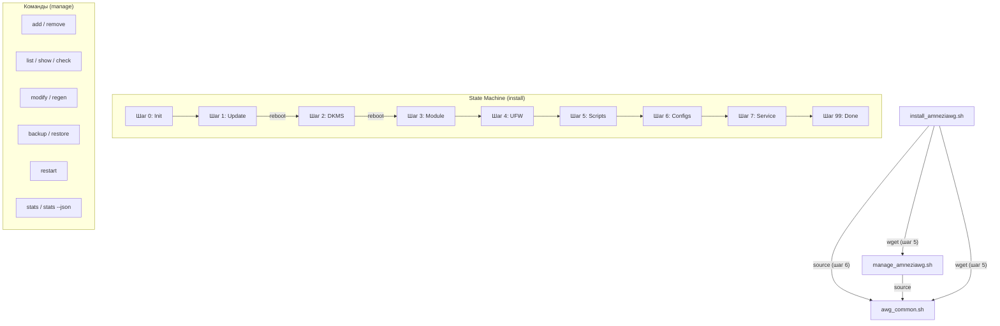

# Advanced
URL: https://raw.githubusercontent.com/bivlked/amneziawg-installer/main/ADVANCED.md


 RU Русский | EN English 
 

# AmneziaWG 2.0 Installer: Дополнительная информация и настройки

Это дополнение к основному [README.md](README.md), содержащее более глубокие технические детали, пояснения и продвинутые опции для скриптов установки и управления AmneziaWG 2.0.

## Оглавление

 
- [✨ Возможности (Подробно)](#features-detailed-adv)
- [🔐 Параметры AWG 2.0](#awg2-params-adv)
 - [Presets (v5.10.0+)](#presets-adv)
- [⚙️ Детали конфигурации клиента](#config-details-adv)
 - [AllowedIPs](#allowedips-adv)
 - [IPv6 dual-stack в туннеле (v5.15.0+)](#ipv6-tunnel-adv)
 - [PersistentKeepalive](#persistentkeepalive-adv)
 - [DNS](#dns-adv)
 - [Изменение настроек по умолчанию](#change-defaults-adv)
- [🔒 Настройки безопасности сервера](#security-adv)
 - [Фаервол UFW](#ufw-adv)
 - [Параметры ядра (Sysctl)](#sysctl-adv)
 - [Fail2Ban (Автоматическая установка)](#fail2ban-adv)
- [🧹 Оптимизация сервера](#optimization-adv)
- [📋 Примеры конфигурации](#config-examples-adv)
- [⚙️ CLI Параметры запуска скриптов](#cli-params-adv)
 - [install_amneziawg.sh](#install-cli-adv)
 - [manage_amneziawg.sh](#manage-cli-adv)
- [🧑‍💻 Полный список команд управления](#manage-commands-adv)
- [🛠️ Технические детали](#tech-details-adv)
 - [Архитектура скриптов](#architecture-adv)
 - [DKMS](#dkms-adv)
 - [Генерация ключей и конфигов](#keygen-adv)
- [🔄 Как обновить скрипты](#update-scripts-adv)
- [❓ FAQ (Дополнительные вопросы)](#faq-advanced-adv)
- [🩺 Диагностика и деинсталляция](#diag-uninstall-adv)
 - [Содержимое диагностического отчёта](#diagnostic-report-adv)
- [🔧 Устранение неполадок (подробно)](#troubleshooting-adv)
- [📊 Статистика трафика (stats)](#stats-adv)
- [⏳ Временные клиенты (--expires)](#expires-adv)
- [📱 vpn:// URI импорт](#vpnuri-adv)
- [📱 MTU и мобильные клиенты](#mtu-mobile-adv)
- [📋 Совместимость клиентов AWG 2.0](#client-compat-adv)
- [🐧 Поддержка Debian](#debian-support-adv)
- [🔧 Raspberry Pi и ARM64](#arm-support-adv)
- [📦 LXC / Docker через amneziawg-go (userspace)](#lxc-userspace-adv)
- [⚠️ Известные ограничения](#limitations-adv)
- [🤝 Внесение вклада (Contributing)](#contributing-adv)
- [💖 Благодарности](#thanks-adv)

---

> История изменений по версиям: [CHANGELOG.md](CHANGELOG.md)

---

 
## ✨ Возможности (Подробно)

* **AmneziaWG 2.0:** Поддержка протокола нового поколения с расширенными параметрами обфускации (H1-H4 диапазоны, S3-S4, CPS I1).
* **Нативная генерация:** Ключи генерируются через `awg genkey/pubkey`, конфиги — через Bash-шаблоны, QR — через `qrencode`. Внешняя зависимость от Python/awgcfg.py полностью устранена.
* **Автоматическая установка:** Устанавливает AmneziaWG, DKMS модуль, зависимости, настраивает сеть, фаервол, sysctl.
* **Возобновляемость:** Использует файл состояния (`/root/awg/setup_state`) для продолжения после обязательных перезагрузок.
* **Оптимизация сервера:**
 * Удаление ненужных пакетов (snapd, modemmanager, и др.)
 * Hardware-aware настройка swap и сетевых буферов
 * Отключение NIC offloads (GRO/GSO/TSO) для оптимизации VPN
* **Безопасность по умолчанию:**
 * `UFW`: Политика `deny incoming`, лимит SSH, разрешение VPN-порта.
 * `IPv6`: По умолчанию предлагается отключить через `sysctl`.
 * `Права доступа`: Строгие права (600/700) на все ключи и конфиги.
 * `Sysctl`: BBR congestion control, защита от спуфинга, оптимизация TCP.
 * `Fail2Ban`: Автоматическая установка и настройка для SSH.
* **Резервное копирование:** Команда `backup` в скрипте управления (включая ключи клиентов).

---

 
## 🔐 Параметры AWG 2.0

Все параметры генерируются автоматически при установке и сохраняются в `/root/awg/awgsetup_cfg.init`. Они одинаковы для сервера и всех клиентов.

| Параметр | Описание | Диапазон | Пример |
|----------|----------|----------|--------|
| `Jc` | Количество junk-пакетов | 3-6 | `5` |
| `Jmin` | Мин. размер junk (байт) | 40-89 | `55` |
| `Jmax` | Макс. размер junk (байт) | Jmin+50..Jmin+250 | `200` |
| `S1` | Padding init-сообщения (байт) | 15-150 | `72` |
| `S2` | Padding response-сообщения (байт) | 15-150, S1+56≠S2 | `56` |
| `S3` | Padding cookie-сообщения (байт) | 8-55 | `32` |
| `S4` | Padding data-сообщения (байт) | 4-27 | `16` |
| `H1` | Идентификатор init-сообщения | Диапазон uint32 | `134567-245678` |
| `H2` | Идентификатор response-сообщения | Диапазон uint32 | `3456789-4567890` |
| `H3` | Идентификатор cookie-сообщения | Диапазон uint32 | `56789012-67890123` |
| `H4` | Идентификатор data-сообщения | Диапазон uint32 | `456789012-567890123` |
| `I1` | CPS concealment packet | Формат ` ` | ` ` |

**Критические ограничения:**
* H1-H4 диапазоны **не должны пересекаться** (гарантируется алгоритмом генерации).
* `S1 + 56 ≠ S2` — предотвращает одинаковый размер init и response сообщений.
* Все узлы (сервер + клиенты) **должны** использовать одинаковые параметры.

 
### Presets (v5.10.0+)

Presets — это готовые наборы параметров обфускации, оптимизированные для конкретных условий сети. Выбираются при установке через флаг `--preset`.

| Preset | Jc | Jmin | Jmax | Когда использовать |
|--------|-----|------|------|-------------------|
| `default` | 3-6 (случайно) | 40-89 | Jmin + 50..250 | Домашний и проводной интернет, стандартные VPS |
| `mobile` | **3** (фиксированный) | 30-50 | Jmin + 20..80 | Мобильные операторы (Tele2, Yota, Мегафон, Таттелеком) |

**Установка с preset:**

```bash
# Стандартный профиль (по умолчанию)
sudo bash install_amneziawg.sh --yes --route-amnezia

# Мобильный профиль — для SIM-карт, LTE/5G модемов, мобильных роутеров
sudo bash install_amneziawg.sh --preset=mobile --yes --route-amnezia
```

**Точечные переопределения (`--jc`, `--jmin`, `--jmax`):**

Можно переопределить отдельные параметры поверх любого preset:

```bash
# Mobile preset, но Jc=4 вместо 3
sudo bash install_amneziawg.sh --preset=mobile --jc=4 --yes --route-amnezia

# Полностью ручные параметры
sudo bash install_amneziawg.sh --jc=2 --jmin=20 --jmax=60 --yes --route-amnezia
```

| Флаг | Диапазон | Описание |
|------|---------|----------|
| `--jc=N` | 1-128 | Количество junk-пакетов |
| `--jmin=N` | 0-1280 | Минимальный размер junk (байт) |
| `--jmax=N` | 0-1280 | Максимальный размер junk (байт), должен быть ≥ Jmin |

> **Совет:** Если VPN работает на домашнем Wi-Fi, но нестабилен через мобильную сеть — переустановите с `--preset=mobile`. Подробнее о проблемах мобильных операторов — в FAQ.

---

 
## ⚙️ Детали конфигурации клиента

 
### AllowedIPs

Определяет, какой трафик **клиент** направляет в VPN-туннель.

1. **Режим 1: Весь трафик (`0.0.0.0/0`)**
 * Весь IPv4 трафик клиента -> VPN.
 * Максимальная приватность. Может блокировать доступ к LAN.

2. **Режим 2: Список Amnezia + DNS (По умолчанию)**
 * Список публичных IP-диапазонов + DNS `1.1.1.1`, `8.8.8.8`.
 * **Цель:** Обход DPI, туннелирование DNS. Рекомендуется.

3. **Режим 3: Пользовательский (Split-Tunneling)**
 * Только трафик к указанным сетям -> VPN.
 * Пример: `192.168.1.0/24,10.50.0.0/16`

**Калькулятор AllowedIPs:** [WireGuard AllowedIPs Calculator](https://www.procustodibus.com/blog/2021/03/wireguard-allowedips-calculator/).

 
### IPv6 dual-stack в туннеле (v5.15.0+)

По умолчанию туннель работает только по IPv4. Начиная с v5.15.0 можно дополнительно включить IPv6 внутри туннеля - клиенты получают IPv6-адрес рядом с IPv4 (dual-stack).

**Когда включается:** только при явном флаге `--allow-ipv6-tunnel` у `install_amneziawg.sh`. Без флага поведение идентично предыдущим версиям. Это отдельная настройка от `--allow-ipv6` / `--disallow-ipv6`, которые управляют IPv6 на уровне хоста (sysctl) и не меняются.

**Взаимодействие с `--disallow-ipv6`.** Туннельному IPv6 нужен форвардинг IPv6 на хосте, поэтому при сочетании `--allow-ipv6-tunnel` с `--disallow-ipv6` флаг туннеля побеждает: установщик пишет предупреждение в лог и оставляет форвардинг IPv6 на хосте включённым. Это не происходит молча.

**Полный туннель при dual-stack.** Когда включён `--allow-ipv6-tunnel`, клиентский конфиг использует полный туннель по IPv4 (`AllowedIPs` начинается с `0.0.0.0/0`) независимо от выбранного режима `--route-amnezia` / `--route-custom` (split-tunnel). В v5.15.0 dual-stack подразумевает full-tunnel; сочетание split-tunnel с IPv6 внутри туннеля пока не поддерживается.

**Подсеть:** приватная ULA `fddd:2c4:2c4:2c4::/64`. Сервер занимает `::1`, клиенты получают `::2`, `::3` и т.д. зеркально нумерации IPv4. Подсеть можно переопределить до первого запуска через `IPV6_SUBNET=` в `/root/awg/awgsetup_cfg.init`.

**Поведение с нативным IPv6 и без него.** При установке скрипт проверяет наличие глобального IPv6 на сервере (`ip -6 addr show scope global`):

- **Есть нативный IPv6:** клиент получает `AllowedIPs = 0.0.0.0/0, ::/0` - весь IPv6-трафик идёт через VPN и выходит в интернет.
- **Нет нативного IPv6:** клиент получает только туннельную подсеть в `AllowedIPs` (без `::/0`): `AllowedIPs = 0.0.0.0/0, fddd:2c4:2c4:2c4::/64`. В лог выводится предупреждение. Так IPv6 работает между пирами внутри туннеля, но не уходит в интернет (иначе пакеты дропались бы в чёрную дыру). Туннель остаётся полностью рабочим по IPv4.

**Как добавить к существующей установке.** Запустите установщик повторно с `--force` и флагом туннеля:

```bash
sudo bash ./install_amneziawg.sh --force --allow-ipv6-tunnel
# для EN-версии: sudo bash ./install_amneziawg_en.sh --force --allow-ipv6-tunnel
```

`--force` обязателен: без него запуск на уже работающем сервере прерывается idempotency-гардом и флаг игнорируется. Именно `--force` заново рендерит серверный конфиг как dual-stack (`[Interface] Address`, sysctl, PostUp с ip6tables). Без него существующая установка остаётся без изменений, и сервер так и не получает IPv6. Одной только записи `ALLOW_IPV6_TUNNEL=1` в `/root/awg/awgsetup_cfg.init` недостаточно - она не перерендеривает серверный конфиг.

Уже выданные IPv4-only клиенты при этом не меняются. Чтобы дать IPv6 такому клиенту, пересоздайте его - только при пересоздании серверу выделяется IPv6 для этого клиента:

```bash
sudo bash /root/awg/manage_amneziawg.sh remove <имя>
sudo bash /root/awg/manage_amneziawg.sh add <имя>
```

Затем заново импортируйте новый `.conf` на устройство. Обычный `regen` здесь не поможет: он зеркалит адреса из записи `[Peer]` на сервере, а у старого клиента IPv6 в ней ещё нет, так что конфиг останется IPv4-only. `manage list` корректно показывает смешанное состояние (dual-stack рядом с IPv4-only).

**Устранение неполадок:**

- **Конфликт ULA-подсети.** Если `fddd:2c4:2c4:2c4::/64` уже используется в вашей сети, задайте другую ULA-подсеть через `IPV6_SUBNET=` до установки.
- **IPv6 не маршрутизируется в интернет.** Проверьте, есть ли на сервере глобальный IPv6 (`ip -6 addr show scope global`). Без него выход в IPv6-интернет невозможен - это ожидаемое поведение, туннель работает по IPv4. Если IPv6 на сервере есть, проверьте правило ip6tables MASQUERADE и форвардинг (`sysctl net.ipv6.conf.all.forwarding`).
- **Откат / очистка IPv6.** Выключение `ALLOW_IPV6_TUNNEL=0` не удаляет уже добавленные dual-stack записи `AllowedIPs` из `awg0.conf`. Для полной очистки: `awg-quick down awg0; sed -i 's|, fddd:[^/]*/[0-9]*||g' /etc/amnezia/amneziawg/awg0.conf; awg-quick up awg0`.

 
### PersistentKeepalive

* **Значение по умолчанию:** `33` секунды.
* Поддерживает UDP-сессию через NAT.
* **Изменение:** `sudo bash /root/awg/manage_amneziawg.sh modify <имя> PersistentKeepalive 25`

 
### DNS

* **Значение по умолчанию:** `1.1.1.1` (Cloudflare).
* DNS-сервер для клиента внутри VPN.
* **Изменение:** `sudo bash /root/awg/manage_amneziawg.sh modify <имя> DNS "8.8.8.8,1.0.0.1"`

 
### Изменение настроек по умолчанию

Для изменения DNS или PersistentKeepalive по умолчанию для **новых** клиентов отредактируйте функцию `render_client_config()` в файле `awg_common.sh` **перед** первым запуском.

---

 
## 🔒 Настройки безопасности сервера

 
### Фаервол UFW

* **Политики:** Deny incoming, Allow outgoing, Deny routed.
* **Правила:** `limit 22/tcp` (SSH), `allow <порт_vpn>/udp`, `route allow in on awg0 out on ` (маршрутизация VPN-трафика, добавлено в v5.7.6).
* **Проверка:** `sudo ufw status verbose`

 
### Параметры ядра (Sysctl)

Файл: `/etc/sysctl.d/99-amneziawg-security.conf`. Включает:
* IP forwarding
* IPv6 disable (опц.)
* BBR congestion control + FQ qdisc
* TCP hardening (syncookies, rp_filter, RFC1337)
* Отключение ICMP redirects и source routing
* Адаптивные сетевые буферы (rmem/wmem по объёму RAM)
* nf_conntrack_max = 65536
* kernel.sysrq = 0

 
### Fail2Ban (Автоматическая установка)

* Автоматически устанавливается и настраивается для защиты SSH.
* **Настройки:** Бан через `ufw`, 5 попыток -> бан на 1 час.
* **Debian:** Автоматически используется `backend = systemd` (journald). На Ubuntu — `backend = auto`.
* **Проверка:** `sudo fail2ban-client status sshd`.

#### Безопасная загрузка конфигурации (v5.7.2)

Начиная с v5.7.2, файл параметров `awgsetup_cfg.init` загружается через `safe_load_config()` — whitelist-парсер, который принимает только заранее определённые ключи (`AWG_*`, `OS_*`, `DISABLE_IPV6`, `ALLOWED_IPS_*`, `NO_TWEAKS` и др.). Прежний метод через `source` заменён полностью. Парсер корректно обрабатывает значения как в одинарных, так и в двойных кавычках (`'value'` или `"value"`).

Это защищает от потенциальной инъекции кода: даже если файл конфигурации будет модифицирован, произвольные команды не выполнятся.

---

 
## 🧹 Оптимизация сервера

Скрипт установки автоматически оптимизирует сервер:

**Удаляемые пакеты:** `snapd`, `modemmanager`, `networkd-dispatcher`, `unattended-upgrades`, `packagekit`, `lxd-agent-loader`, `udisks2`. Cloud-init удаляется **только** если не управляет сетевой конфигурацией.

**Hardware-aware настройки:**
* **Swap:** 1 ГБ при RAM ≤ 2 ГБ, 512 МБ при RAM > 2 ГБ. `vm.swappiness = 10`.
* **NIC:** Отключение GRO/GSO/TSO (могут конфликтовать с VPN-трафиком).
* **Сетевые буферы:** Автоматическая настройка `rmem_max`/`wmem_max` в зависимости от объёма RAM.

---

 
## 📋 Примеры конфигурации

 
 awgsetup_cfg.init (параметры установки) 

```bash
# Конфигурация установки AmneziaWG 2.0 (Авто-генерация)
export AWG_PORT=39743
export AWG_TUNNEL_SUBNET='10.9.9.1/24'
export DISABLE_IPV6=1
export ALLOWED_IPS_MODE=2
export ALLOWED_IPS='0.0.0.0/5, 8.0.0.0/7, ...'
export AWG_ENDPOINT=''
export AWG_Jc=6
export AWG_Jmin=55
export AWG_Jmax=205
export AWG_S1=72
export AWG_S2=56
export AWG_S3=32
export AWG_S4=16
export AWG_H1='234567-345678'
export AWG_H2='3456789-4567890'
export AWG_H3='56789012-67890123'
export AWG_H4='456789012-567890123'
export AWG_I1='<r 128>'
export AWG_PRESET='default'
```
 

 
 awg0.conf (серверный конфиг, ключи замаскированы) 

```ini
[Interface]
PrivateKey = [SERVER_PRIVATE_KEY]
Address = 10.9.9.1/24
MTU = 1280
ListenPort = 39743
PostUp = iptables -I FORWARD -i %i -j ACCEPT; iptables -t nat -A POSTROUTING -o eth0 -j MASQUERADE
PostDown = iptables -D FORWARD -i %i -j ACCEPT; iptables -t nat -D POSTROUTING -o eth0 -j MASQUERADE
Jc = 6
Jmin = 55
Jmax = 205
S1 = 72
S2 = 56
S3 = 32
S4 = 16
H1 = 234567-345678
H2 = 3456789-4567890
H3 = 56789012-67890123
H4 = 456789012-567890123
I1 = <r 128>

[Peer]
#_Name = my_phone
PublicKey = [CLIENT_PUBLIC_KEY]
AllowedIPs = 10.9.9.2/32
```
 

 
 Минимальный awg0.conf для AWG 2.0 (если настраивается вручную) 

Если разворачиваете сервер не моим инсталлятором (например, `amneziawg-go` в LXC), минимальный валидный `awg0.conf` для AWG 2.0 выглядит так — все 11 обфускационных параметров обязательны, `manage_amneziawg.sh add/regen` упадёт с ошибкой если хотя бы один отсутствует:

```ini
[Interface]
PrivateKey = [SERVER_PRIVATE_KEY]
Address = 10.9.9.1/24
ListenPort = 51820
Jc = 4
Jmin = 40
Jmax = 90
S1 = 50
S2 = 40
S3 = 12
S4 = 8
H1 = 1234567
H2 = 2345678
H3 = 3456789
H4 = 4567890
```

Нюансы для ручной установки:

- **S3/S4** — параметры AWG 2.0, добавлены в протокол позже S1/S2. В конфигах от предыдущих версий (AWG 1.x) их может не быть — надо дописать руками, значения любые в диапазоне 0-127, главное что вообще есть.
- **H1–H4** могут быть single-value (`H1 = 1234567`) или range (`H1 = 100000-200000`), диапазоны не должны пересекаться. Безопасный верхний предел — 2147483647 (`INT32_MAX`), иначе `amneziawg-windows-client` может подсвечивать значения как invalid.
- **I1** (CPS-пакеты) опционален: без него AWG-клиент работает в AWG 1.0 fallback режиме. Для полной AWG 2.0 обфускации — добавить `I1 = ` (random 128 байт) или `I1 = ` (binary).
- **MTU**, **PostUp/PostDown** — опциональны, зависят от сетапа (см. `amneziawg-go` секцию про iptables MASQUERADE в LXC).

После создания такого `awg0.conf` `manage_amneziawg.sh` требует ещё два файла: `/root/awg/server_public.key` (вычисляется: `awg pubkey < /etc/amnezia/amneziawg/server_private.key > /root/awg/server_public.key`) и минимальный `/root/awg/awgsetup_cfg.init` с `AWG_PORT`, `AWG_TUNNEL_SUBNET`, `AWG_ENDPOINT`.

 

 
 client.conf (клиентский конфиг, ключи замаскированы) 

```ini
[Interface]
PrivateKey = [CLIENT_PRIVATE_KEY]
Address = 10.9.9.2/32
DNS = 1.1.1.1
MTU = 1280
Jc = 6
Jmin = 55
Jmax = 205
S1 = 72
S2 = 56
S3 = 32
S4 = 16
H1 = 234567-345678
H2 = 3456789-4567890
H3 = 56789012-67890123
H4 = 456789012-567890123
I1 = <r 128>

[Peer]
PublicKey = [SERVER_PUBLIC_KEY]
Endpoint = 203.0.113.1:39743
AllowedIPs = 0.0.0.0/5, 8.0.0.0/7, ...
PersistentKeepalive = 33
```
 

---

 
## 🖥️ CLI Параметры запуска скриптов

 
### install_amneziawg.sh

```
Опции:
  -h, --help            Показать справку
  --uninstall           Удалить AmneziaWG
  --diagnostic          Создать диагностический отчет
  -v, --verbose         Расширенный вывод (включая DEBUG)
  --no-color            Отключить цветной вывод
  --port=НОМЕР          Установить UDP порт (1024-65535)
  --subnet=ПОДСЕТЬ      Установить подсеть туннеля (x.x.x.x/yy)
  --allow-ipv6          Оставить IPv6 включенным
  --disallow-ipv6       Принудительно отключить IPv6
  --allow-ipv6-tunnel   Включить dual-stack IPv6 внутри туннеля (ULA, opt-in)
  --route-all           Режим: Весь трафик (0.0.0.0/0)
  --route-amnezia       Режим: Список Amnezia+DNS (умолч.)
  --route-custom=СЕТИ   Режим: Только указанные сети
  --endpoint=IP         Указать внешний IP (для серверов за NAT)
  --preset=ТИП          Набор параметров обфускации: default, mobile
                        mobile: Jc=3, узкий Jmax — для мобильных операторов (Tele2, Yota, Мегафон)
  --jc=N                Задать Jc вручную (1-128, поверх preset)
  --jmin=N              Задать Jmin вручную (0-1280, поверх preset)
  --jmax=N              Задать Jmax вручную (0-1280, поверх preset, ≥ Jmin)
  -y, --yes             Неинтерактивный режим (все подтверждения auto-yes)
  --no-tweaks           Пропустить hardening/оптимизацию (без UFW, Fail2Ban, sysctl tweaks)
```

 
### manage_amneziawg.sh

```
Опции:
  -h, --help            Показать справку
  -v, --verbose         Расширенный вывод (для list)
  --no-color            Отключить цветной вывод
  --conf-dir=ПУТЬ       Указать директорию AWG (умолч: /root/awg)
  --server-conf=ПУТЬ    Указать файл конфига сервера
  --json                JSON-вывод (для команды stats)
  --expires=ВРЕМЯ       Срок действия при add (1h, 12h, 1d, 7d, 30d, 4w)
  --apply-mode=РЕЖИМ    syncconf (умолч.) или restart (обход kernel panic)
  --psk                 (только для add) сгенерировать PresharedKey для клиента (v5.11.1+)
```

> **`--psk`** — опциональный дополнительный слой поверх AWG 2.0 обфускации. Генерирует 32-байт симметричный ключ через `awg genpsk`, пишет его в серверный `[Peer]` и в клиентский `[Peer]` (`PresharedKey = ...`). Совместим с любым WireGuard/AmneziaWG клиентом. В batch-режиме `add c1 c2 c3 --psk` каждому клиенту выдаётся свой PSK. Без флага клиенты создаются без `PresharedKey` (default — AWG 2.0 обфускации достаточно для большинства сценариев). Флаг влияет только на новых клиентов, создаваемых этим вызовом `add` — существующие клиенты без PSK остаются без изменений и продолжают подключаться как раньше.

**Переменные среды:**

| Переменная | Описание |
|------------|----------|
| `AWG_SKIP_APPLY=1` | Пропустить apply_config. Для автоматизации: накопить N операций, применить одной командой |
| `AWG_APPLY_MODE=restart` | Полный перезапуск вместо syncconf (можно сохранить в `awgsetup_cfg.init`) |

---

 
## 🧑‍💻 Полный список команд управления

Используйте `sudo bash /root/awg/manage_amneziawg.sh <команда>`:

> **Как `manage` находит клиентов в серверном конфиге.** Каждый `[Peer]`, созданный моим инсталлятором/`manage add`, содержит комментарий-маркер `#_Name = <имя>` на первой строке блока. Именно по нему `list`, `remove`, `regen`, `modify` находят нужного клиента. Если вы переносите `awg0.conf` со старого сервера или добавляете peer руками — дописывайте `#_Name = <имя>` после `[Peer]`, иначе `manage` не увидит такого клиента. Пример: блок `[Peer]` в серверном конфиге выше (см. [Примеры конфигурации](#config-examples-adv)).

* **`add <имя> [имя2 ...] [--expires=ВРЕМЯ] [--psk]`:** Добавить одного или нескольких клиентов. При batch-создании `awg syncconf` вызывается один раз для всех. С `--expires` — срок действия применяется ко всем. С `--psk` — для каждого генерируется отдельный PresharedKey (v5.11.1+).
* **`remove <имя> [имя2 ...]`:** Удалить одного или нескольких клиентов. При batch-удалении apply_config вызывается один раз.
* **`list [-v]`:** Список клиентов (с деталями при `-v`).
* **`regen [имя]`:** Перегенерировать файлы `.conf`/`.png` для клиента или всех клиентов.
* **`modify <имя> <пар> <зн>`:** Изменить параметр клиента в `.conf` файле. Допустимые параметры: DNS, Endpoint, AllowedIPs, PersistentKeepalive. После изменения QR-код и vpn:// URI автоматически перегенерируются.
* **`backup`:** Создать резервную копию (конфиги + ключи + данные истечения клиентов + cron).
* **`restore [файл]`:** Восстановить из резервной копии (включая данные истечения и cron-задачу).
* **`check` / `status`:** Проверить состояние сервера (сервис, порт, AWG 2.0 параметры).
* **`show`:** Выполнить `awg show`.
* **`restart`:** Перезапустить сервис AmneziaWG.
* **`help`:** Показать справку.
* **`stats [--json]`:** Статистика трафика по клиентам. С `--json` — машиночитаемый формат для интеграции.

### Примеры использования

```bash
# Изменить DNS клиента
sudo bash /root/awg/manage_amneziawg.sh modify my_phone DNS "8.8.8.8,1.0.0.1"

# Изменить PersistentKeepalive
sudo bash /root/awg/manage_amneziawg.sh modify my_phone PersistentKeepalive 25

# Изменить AllowedIPs (split-tunneling)
sudo bash /root/awg/manage_amneziawg.sh modify my_phone AllowedIPs "192.168.1.0/24,10.0.0.0/8"

# Перегенерировать конфиг одного клиента
sudo bash /root/awg/manage_amneziawg.sh regen my_phone

# Создать бэкап
sudo bash /root/awg/manage_amneziawg.sh backup

# Восстановить из последнего бэкапа (интерактивный выбор)
sudo bash /root/awg/manage_amneziawg.sh restore
```

---

 
## 🛠️ Технические детали

 
### Архитектура скриптов

| Файл | Назначение |
|------|-----------|
| `install_amneziawg.sh` | Установщик: state machine из 8 шагов с поддержкой resume |
| `manage_amneziawg.sh` | Управление: add/remove/list/regen/stats/backup/restore |
| `awg_common.sh` | Общая библиотека: ключи, конфиги, QR, peer management |
| `install_amneziawg_en.sh` | Установщик (English версия) |
| `manage_amneziawg_en.sh` | Управление (English версия) |
| `awg_common_en.sh` | Общая библиотека (English версия) |

`awg_common.sh` подключается через `source` из обоих скриптов. Установщик скачивает его на шаге 5.



 
### DKMS

Пересборка модуля ядра `amneziawg` при обновлении ядра. Проверка: `dkms status`.

 
### Генерация ключей и конфигов

**Полностью нативная** генерация:
* **Ключи:** `awg genkey` + `awg pubkey` (стандартные утилиты AmneziaWG).
* **Конфиги:** Bash-шаблоны с AWG 2.0 параметрами.
* **QR-коды:** `qrencode -t png`.
* **Python/awgcfg.py:** Убраны полностью. Workaround для бага удаления конфига больше не нужен.

Ключи клиентов хранятся в `/root/awg/keys/` (права 600). Серверные ключи — в `/root/awg/server_private.key` и `server_public.key`.

#### Привязка URL к версии (v5.7.2)

Инсталлятор скачивает `awg_common.sh` и `manage_amneziawg.sh` с URL, привязанных к конкретному тегу версии:

```
https://raw.githubusercontent.com/bivlked/amneziawg-installer/v5.15.0/awg_common.sh
```

Это даёт **supply chain pinning**: скачиваемые скрипты соответствуют версии инсталлятора, даже если `main` уже обновлён.

Для разработки можно переопределить ветку:

```bash
AWG_BRANCH=my-feature-branch sudo bash ./install_amneziawg.sh
```

---

 
## 🔄 Как обновить скрипты

Для обновления скриптов управления и общей библиотеки **без переустановки сервера**:

```bash
# Русская версия:
wget -O /root/awg/manage_amneziawg.sh https://raw.githubusercontent.com/bivlked/amneziawg-installer/v5.15.0/manage_amneziawg.sh
wget -O /root/awg/awg_common.sh https://raw.githubusercontent.com/bivlked/amneziawg-installer/v5.15.0/awg_common.sh

# Английская версия:
wget -O /root/awg/manage_amneziawg.sh https://raw.githubusercontent.com/bivlked/amneziawg-installer/v5.15.0/manage_amneziawg_en.sh
wget -O /root/awg/awg_common.sh https://raw.githubusercontent.com/bivlked/amneziawg-installer/v5.15.0/awg_common_en.sh

# Установить права
chmod 700 /root/awg/manage_amneziawg.sh /root/awg/awg_common.sh
```

> **Примечание:** Переустановка скрипта `install_amneziawg.sh` **не требуется** для обновления управления. Переустановка нужна только при смене версии протокола.

---

 
## ❓ FAQ (Дополнительные вопросы)

 
 В: Как изменить порт AmneziaWG после установки? 
 **О:** 1. Измените `ListenPort` в `/etc/amnezia/amneziawg/awg0.conf`. 2. Измените `AWG_PORT` в `/root/awg/awgsetup_cfg.init`. 3. Обновите UFW (`sudo ufw delete allow <старый_порт>/udp`, `sudo ufw allow <новый_порт>/udp`). 4. Перезапустите сервис (`sudo systemctl restart awg-quick@awg0`). 5. **Перегенерируйте конфиги ВСЕХ клиентов** (`sudo bash /root/awg/manage_amneziawg.sh regen`) и передайте их клиентам.
 

 
 В: Как изменить внутреннюю подсеть VPN? 
 **О:** Проще всего выполнить деинсталляцию (`sudo bash ./install_amneziawg.sh --uninstall`) и установить заново, указав новую подсеть при первом запуске.
 

 
 В: Как изменить MTU? 
 **О:** Начиная с v5.7.4 `MTU = 1280` устанавливается автоматически. Для изменения: отредактируйте строку `MTU = <значение>` в секции `[Interface]` файла `/etc/amnezia/amneziawg/awg0.conf` и в `.conf` файлах клиентов. Перезапустите сервис. Подробнее — в разделе MTU и мобильные клиенты.
 

 
 В: Где хранятся параметры AWG 2.0? 
 **О:** В файле `/root/awg/awgsetup_cfg.init` (переменные AWG_Jc, AWG_S1..S4, AWG_H1..H4, AWG_I1). Эти же параметры записываются в серверный и клиентские конфиги.
 

 
 В: Можно ли изменить параметры AWG 2.0 после установки? 
 О: Да. Это полезно если оператор начал детектировать ваш сервер по статическим параметрам обфускации (например, ТСПУ заблокировал определённые H1-H4 диапазоны). Порядок действий с v5.8.0:
 
 Отредактируйте параметры (Jc, S1-S4, H1-H4, I1) в /etc/amnezia/amneziawg/awg0.conf в секции [Interface]. 
 Перезапустите сервис: sudo systemctl restart awg-quick@awg0. 
 Перегенерируйте конфиги всех клиентов: sudo bash /root/awg/manage_amneziawg.sh regen <имя> для каждого. С v5.8.0 regen читает актуальные значения прямо из awg0.conf (источник истины), а не из закешированного awgsetup_cfg.init. 
 Раздайте новые.conf / QR-коды / vpn:// URI клиентам. 
 
 Важно: параметры на сервере и всех клиентах должны совпадать — иначе handshake не пройдёт. Для генерации новых случайных непересекающихся H1-H4 диапазонов проще всего переустановить сервер ( --uninstall + повторная установка) — каждая установка генерирует уникальный набор.
 

 
 В: Сервер за NAT — как указать внешний IP? 
 **О:** Используйте флаг `--endpoint=<внешний_IP>` при установке: `sudo bash ./install_amneziawg.sh --endpoint=1.2.3.4`. Или укажите его позже через `sudo bash /root/awg/manage_amneziawg.sh regen` (скрипт попытается определить IP автоматически).
 

 
 В: Как настроить проброс портов (NAT) для AmneziaWG? 
 **О:** Если сервер находится за NAT (например, в облаке с приватным IP): 1. Пробросьте UDP-порт AmneziaWG (по умолчанию 39743) на внешний IP. 2. При установке укажите внешний IP: --endpoint=ВНЕШНИЙ_IP. 3. Убедитесь, что фаервол провайдера разрешает входящий UDP на этот порт.
 

 
 В: Как изменить DNS для всех существующих клиентов? 
 **О:** Используйте команду modify для каждого клиента: sudo bash /root/awg/manage_amneziawg.sh modify <имя> DNS "8.8.8.8,1.0.0.1". Затем перегенерируйте конфиги: sudo bash /root/awg/manage_amneziawg.sh regen. Для изменения DNS по умолчанию для новых клиентов отредактируйте awg_common.sh.
 

 
 В: Как мониторить трафик VPN? 
 **О:** 1. Текущие подключения: sudo awg show. 2. Статистика передачи: sudo awg show awg0 transfer. 3. Логи сервиса: sudo journalctl -u awg-quick@awg0 -f. 4. Общий статус: sudo bash /root/awg/manage_amneziawg.sh check.
 

 
 В: Ошибка «Неверный ключ: s3» при импорте конфига в Windows-клиент? 
 О: Вы используете устаревшую версию amneziawg-windows-client (< 2.0.0), которая не понимает параметры AWG 2.0. Обновите до версии 2.0.0+. Альтернатива — Amnezia VPN >= 4.8.12.7.
 

 
 В: AWG 2.0-сервер не handshake-ится с моим старым AWG 1.0-клиентом — почему? 
 О: Когда сервер генерирует S3>0 или S4>0 (cookie-/data-padding из AWG 2.0), AWG 1.0-клиент не сможет с ним handshake-нуться — это известная upstream-проблема: amnezia-vpn/amneziawg-linux-kernel-module#168. Мой инсталлятор всегда генерирует S3=8..55, S4=4..27 — оба >0.
 
 В типичном сценарии (Amnezia VPN client / WireGuard-Tools 2.0+ на клиентах + клиентские.conf, сгенерированные manage add) проблемы нет: manage всегда вписывает S3 / S4 в клиентский.conf автоматически. Риск возникает только при:
 
 ручной правке клиентских.conf со снятием S3 / S4; 
 импорте серверного preset в WireGuard-клиент без AWG-расширений (обычный wg-quick на старом ядре, без amneziawg -модуля); 
 миграции с AWG 1.x setup, где клиенты намеренно использовали S3=0 / S4=0. 
 
 Решение: использовать AWG 2.0-совместимый клиент (Amnezia VPN >= 4.8.12.7 или amneziawg-windows-client >= 2.0.0) и держать S3 / S4 в client.conf идентичными серверным. Если очень нужен AWG 1.0 fallback — это отдельная задача за пределами штатного сценария установки, ждите фикса в upstream-issue #168.
 

 
 В: Ошибка DKMS при обновлении ядра — что делать? 
 **О:** 1. Проверьте статус: dkms status. 2. Попробуйте пересобрать: sudo dkms install amneziawg/$(dkms status | grep amneziawg | head -1 | awk -F'[,/ ]+' '{print $2}'). 3. Убедитесь, что установлены заголовки ядра: sudo apt install linux-headers-$(uname -r). 4. При неустранимой ошибке запустите диагностику: sudo bash ./install_amneziawg.sh --diagnostic.
 

 
 В: Что меняется для меня после установки v5.12.0+ при обновлении ядра? 
 О: До v5.12.0 после apt upgrade ядра DKMS не всегда успевал пересобрать модуль amneziawg к моменту следующего reboot. Симптом: awg-quick@awg0 падает с modprobe: FATAL: Module amneziawg not found, и VPN лежит до ручной правки.
 
 В v5.12.0 я добавил три страховки, которые работают прозрачно:
 
 apt hook /etc/apt/apt.conf.d/99-amneziawg-post-kernel — после apt upgrade хелпер /usr/local/sbin/amneziawg-ensure-module --hook пересобирает DKMS под новое ядро. Лог: /var/log/amneziawg-ensure-module.log (weekly rotate, 4 копии). 
 systemd unit amneziawg-ensure-module.service — на boot перед awg-quick@awg0 хелпер итерирует ядра с уже установленными headers, пересобирает DKMS под текущее ядро, делает modprobe amneziawg и проверяет загрузку через lsmod. Если headers ещё не установлены — пишет WARN и завершает успехом, не блокируя загрузку. Логи в journal: journalctl -u amneziawg-ensure-module.service. 
 manage repair-module — явный fallback: sudo bash /root/awg/manage_amneziawg.sh repair-module доустановит kernel-headers (с AWG_ALLOW_APT_IN_ENSURE=1), пересоберёт DKMS, перезапустит awg-quick. 
 
 Ручное восстановление (если все три auto-пути не сработали или установка ещё на v5.11.x):
 sudo apt install linux-headers-$(uname -r)
sudo dkms autoinstall
sudo modprobe amneziawg
sudo systemctl restart awg-quick@awg0 
 Ограничения:
 
 ARM prebuilt (Raspberry Pi, Hetzner CAX, Oracle Ampere) использует готовый.deb, а не DKMS — auto-repair не задействован. После kernel upgrade либо переустановите инсталлятор (он подберёт новый prebuilt или fallback на DKMS), либо запустите manage repair-module. 
 Облачные ядра (Azure / AWS / GCP / Oracle / Debian-cloud) — installer определяет meta-package по суффиксу uname -r (например, linux-headers-azure). Если у вас custom kernel или нестандартный flavor — manage repair-module сделает то же самое в reactive-режиме. 
 
 

 
 В: Подробности миграции VPN на другой сервер? 
 **О:** 1. На старом сервере: sudo bash /root/awg/manage_amneziawg.sh backup. 2. Скопируйте архив: scp root@старый_сервер:/root/awg/backups/awg_backup_*.tar.gz .. 3. На новом сервере установите AmneziaWG. 4. Скопируйте бэкап: scp awg_backup_*.tar.gz root@новый_сервер:/root/awg/backups/. 5. Восстановите: sudo bash /root/awg/manage_amneziawg.sh restore (интерактивный выбор, или укажите полный путь к архиву). 6. Перегенерируйте конфиги с новым IP: sudo bash /root/awg/manage_amneziawg.sh regen. 7. Раздайте новые конфиги клиентам.
 

 
 В: Не подключается смартфон через мобильную сеть / не работает на iPhone 
 О: Добавьте MTU = 1280 в секцию [Interface] серверного и клиентского конфигов. Сотовые сети имеют MTU ниже стандартных 1420, а iOS строго обрабатывает PMTU. Подробнее — в разделе MTU и мобильные клиенты.
 

 
 В: Подключается через мобильную сеть только с третьего раза / нестабильно 
 О: Начиная с v5.10.0 достаточно установить с флагом --preset=mobile — он автоматически выставляет оптимальные параметры для мобильных сетей (Jc=3, узкий Jmax). Discussion #38 (@elvaleto): на Таттелеком (Летай) c Jc=4-8 подключалось раза с третьего, а после снижения Jc = 3 заработало сразу.
 
 Новая установка (рекомендуется): 
 sudo bash install_amneziawg.sh --preset=mobile --yes --route-amnezia 

 Существующая установка — ручная правка: 
 
 Откройте /etc/amnezia/amneziawg/awg0.conf и замените Jc на 3, а I1 на <r 64>. 
 sudo systemctl restart awg-quick@awg0 
 sudo bash /root/awg/manage_amneziawg.sh regen <имя_клиента> для каждого клиента. 
 Раздайте обновлённые конфиги. 
 
 Если --preset=mobile недостаточно — попробуйте ещё ниже: --jc=2 --jmin=20 --jmax=60.
 
 Отчёты по операторам (из issues/discussions): 
 
 Оператор Параметры Рекомендация Результат 
 Таттелеком (Летай) Jc=3, I1=<r 64> --preset=mobile ✅ 
 Yota (Москва) I1=<b 0xce...>, Jmax=261 --preset=mobile ✅ 
 Yota/Tele2 (Москва) Jc=3, Jmin=40, Jmax=70 --preset=mobile ✅ 
 Tele2 (Красноярск) ранее I1=отсутствует; май 2026: I1=<r 48> --preset=mobile; в майскую волну I1=<r 48> ✅ 
 МТС (Приморье) Jc=3, I1=<r 48> (май 2026) --preset=mobile + I1=<r 48> ✅ 
 Beeline дефолт --preset=default ✅ 
 Megafon (Москва) Jc=3, Jmin=80, Jmax=268 --preset=mobile 🔄 тестируется 
 Megafon (регионы) I1=отсутствует --preset=mobile + удалить I1 ✅ 
 Tele2 + Мегафон (Кемерово, 42) случайный I1 (<r N>) перестал держаться через 2+ дня; работает QUIC-мимикрия I1=<b 0xc3...> либо I1=отсутствует --preset=mobile + I1=<b 0xc3...> (QUIC) либо удалить I1 ✅ 
 
 
 «I1=отсутствует» означает: в /etc/amnezia/amneziawg/awg0.conf и в клиентских.conf удалить строку I1 = ... целиком (не оставлять пустую). Это AWG 1.0 fallback — без CPS-маскировки, но handshake проходит DPI у некоторых региональных операторов, где CPS-пакеты сами триггерят блок (Issue #42, @alkorrnd). После правки на сервере: sudo systemctl restart awg-quick@awg0. На клиентах — sudo bash /root/awg/manage_amneziawg.sh regen <имя> для каждого, и раздать новые конфиги.
 
 Обновление, май 2026: в майскую волну блокировок вариант I1=отсутствует на Tele2 (Красноярск) перестал срабатывать, а короткий I1 = <r 48> прошёл DPI. То же сработало на МТС (Приморье). Похоже, для этих операторов важен размер I1: меньшее значение <r 48> менее заметно для DPI. Если --preset=mobile или I1=отсутствует не помогают - попробуйте I1 = <r 48>. Профиль diagnose --carrier=tele2_krasnoyarsk пока отражает прежнее I1=отсутствует (Issue #42), так что для майской волны задайте I1 = <r 48> вручную (Discussion #38, @alkorrnd + @etotent).
 
 QUIC-мимикрия I1 (экспериментально): вместо случайного <r N> можно задать I1 как блок, имитирующий начало QUIC-пакета: I1 = <b 0xc30000000108><r 8><b 0x08><r 8><b 0x0045dc><t><r 16>. Первые байты ( 0xC3 + версия) похожи на QUIC v1 long-header, и DPI, который классифицирует UDP/443 как QUIC, в этом отчёте поток пропустил. На Tele2/Мегафон (Кемерово) держится 2+ дня (Issue #42, @Fourdot-co). Это client-side параметр, меняется только в клиентских.conf, синхронизировать с сервером не нужно; учтите, что правка только одного экспортированного.conf потеряется при следующей перегенерации клиента ( regen). Важно: не берите за основу TLS ClientHello ( <b 0x160301...>) - это TCP-формат, в UDP DPI распознает TCP-структуру и дропнет пакет. Для UDP-мимикрии подходят QUIC long-header или DTLS (тот же тип handshake ClientHello, но с record header, где добавлены epoch и sequence number).
 

 
 В: Скрипт ломает VNC-консоль хостера / потеря сети на Hetzner 
 О: До v5.8.2 скрипт устанавливал net.ipv4.conf.all.rp_filter = 1 (strict reverse-path filtering). На Hetzner и подобных облачных хостерах, где шлюз находится в другой подсети чем IP самой VPS, strict mode ломает routing — ответные пакеты не проходят проверку обратного пути. Симптомы: VPS периодически теряет сеть (раз в сутки), а VNC-консоль забивается строками [UFW BLOCK] от Fail2Ban и становится непригодной для работы. Discussion #41 (@z036). С v5.8.2 rp_filter установлен в 2 (loose mode), который проверяет source IP по любому маршруту в таблице (не только обратному через тот же интерфейс), и добавлен kernel.printk = 3 4 1 3 для подавления не-критических kernel messages на VNC-консоли. Если у тебя установка до v5.8.2 — исправь вручную:
 
 Открой /etc/sysctl.d/99-amneziawg-security.conf 
 Замени rp_filter = 1 на rp_filter = 2 (обе строки: conf.all и conf.default) 
 Добавь строку kernel.printk = 3 4 1 3 
 sudo sysctl -p /etc/sysctl.d/99-amneziawg-security.conf 
 
 

 
 В: Не работает ping между сервером и клиентами внутри туннеля 
 О: Скрипт устанавливает ufw default deny incoming — это блокирует всё входящее на всех интерфейсах, включая awg0. Forward-правило ufw route allow in on awg0 out on <public_iface> разрешает только туннель → интернет, а input на awg0 (пакеты от клиентов на сам сервер, в том числе ICMP echo-request) под него не попадает.
 
 Дополнительно: если ты правил /etc/ufw/before.rules и заменил ACCEPT на DROP для ICMP без указания интерфейса, эти правила применяются ко всем интерфейсам — включая awg0.
 
 Решение: 
 
 Открой входящее на awg0 в UFW:
 sudo ufw allow in on awg0
sudo ufw reload 
 Это разрешает входящие на интерфейс туннеля целиком — узкая фильтрация ICMP делается через -i в before.rules (см. ниже).
 
 Если ты правил /etc/ufw/before.rules, добавь -i <public_iface> ко всем DROP-строкам ICMP:
 # вместо
-A ufw-before-input -p icmp --icmp-type echo-request -j DROP
# так (ens3 — твой публичный интерфейс)
-A ufw-before-input -i ens3 -p icmp --icmp-type echo-request -j DROP 
 То же самое для destination-unreachable, time-exceeded, parameter-problem. Имя публичного интерфейса: ip route get 8.8.8.8 | awk '{for(i=1;i<=NF;i++) if($i=="dev") print $(i+1)}'. Применить: sudo ufw reload.
 
 
 Не работает: ufw allow in on awg0 proto icmp — UFW не поддерживает icmp через флаг proto (только tcp/udp/esp/ah/gre/ipv6).
 
 Проверка: с клиента ping <IP_сервера_в_туннеле>. С сервера на клиента ( ping <IP_клиента>) может не отвечать сам клиент: на Windows и iOS встроенный фаервол часто режет echo-request — поэтому надёжнее проверять с клиента на сервер.
 
 Если ты вручную правил AllowedIPs на клиенте под split tunneling (через VPN идут только нужные подсети — например, только Telegram/Discord, а остальной трафик мимо), убедись что в списке есть подсеть туннеля ( 10.9.9.0/24 или твоя кастомная). Без неё клиент не маршрутизирует в туннель даже пакеты к самому серверу — ufw status verbose и iptables -L ufw-before-input -v -n могут выглядеть правильно, а ping всё равно не идёт. Покрытие зависит от выбранного режима: --route-all (полный туннель 0.0.0.0/0) включает подсеть туннеля автоматически; дефолтный --route-amnezia (Amnezia List, исключает 10.0.0.0/8) и --route-custom= - нет, добавляй вручную.
 
 Если нужен пинг между клиентами (телефон ↔ роутер через сервер): sudo ufw route allow in on awg0 out on awg0 && sudo ufw reload. AllowedIPs в клиентских.conf зависит от режима, выбранного при установке (см. абзац выше). Discussion #63.
 

 
 В: Работает ли AmneziaWG в LXC-контейнере? 
 О: Нет. AmneziaWG требует загрузки ядерного модуля через DKMS. LXC-контейнеры разделяют ядро с хостом и не позволяют загружать свои модули. Используйте полноценную VM (KVM/QEMU) или bare-metal.
 

 
 В: --endpoint отклоняется с ошибкой «Некорректный --endpoint» — что проверить? 
 О: С v5.8.0 значение флага --endpoint проходит валидацию перед записью в конфиги. Разрешены три формата: FQDN ( vpn.example.com), IPv4 ( 1.2.3.4), IPv6 в квадратных скобках ( [2001:db8::1]). Запрещены перевод строки, CR, одинарные и двойные кавычки, обратный слеш, пробелы и табуляции — они могли бы инжектиться в awgsetup_cfg.init и клиентские.conf. Если нужно передать IPv6 — оберните в []. Если AWG_ENDPOINT в awgsetup_cfg.init не проходит валидацию при повторном запуске, инсталлятор выводит log_warn и использует автоопределение через get_server_public_ip.
 

 
 В: «Другой экземпляр install_amneziawg.sh уже запущен» — что это? 
 О: С v5.8.0 инсталлятор берёт process-wide flock на /root/awg/.install.lock в начале initialize_setup(). Это защищает от двух параллельных запусков которые иначе могли бы гонять apt-get одновременно и сломать package state. Если ты видишь эту ошибку но никакого второго инсталлятора нет (процесс висит / упал) — удали /root/awg/.install.lock и попробуй снова.
 

 
 В: Почему --uninstall не отключил UFW? 
 О: Это поведение с v5.8.0. Инсталлятор записывает маркер /root/awg/.ufw_enabled_by_installer только если активировал UFW сам (до этого UFW был в состоянии inactive). При --uninstall UFW отключается только при наличии маркера. Если до установки нашего скрипта UFW уже был активен (например, для защиты SSH или web-сервисов), --uninstall удалит наши правила (VPN-порт, awg0 routing), но оставит UFW активным. Это защита от destructive uninstall на чужой инфраструктуре. Если тебе нужно принудительно отключить UFW — ufw disable вручную.
 

 
 В: regen говорит «отсутствуют обязательные AWG-параметры» — что делать? 
 О: С v5.8.0 load_awg_params читает AWG-параметры напрямую из live /etc/amnezia/amneziawg/awg0.conf, а не из закешированного awgsetup_cfg.init. Если ты правил awg0.conf руками и удалил/повредил одно из обязательных полей (Jc, Jmin, Jmax, S1-S4, H1-H4), regen упадёт с этой ошибкой вместо того чтобы молча использовать устаревшие значения из init-файла. Это защита от split-brain между сервером и клиентами. Что делать: (1) проверь grep -E "^(Jc|Jmin|Jmax|S[1-4]|H[1-4]) = " /etc/amnezia/amneziawg/awg0.conf — все 11 полей должны быть; (2) если поле удалено, восстанови его из /root/awg/awgsetup_cfg.init или из awg0.conf.bak-* бэкапа; (3) перезапусти сервис и повтори regen.
 

 
 В: Клиент amneziawg-windows-client подчёркивает H2-H4 красным и не даёт редактировать конфиг 
 О: Это upstream-баг в standalone Windows-клиенте amneziawg-windows-client (форк wireguard-windows с AWG-патчами). Его встроенный редактор конфигов в ui/syntax/highlighter.go ограничивает H1-H4 диапазоном [0, 2147483647] (это 2^31-1, INT32_MAX), хотя спецификация AmneziaWG допускает полный uint32 (0-4294967295). Значения выше 2^31-1 на сервере работают нормально, но клиент подчёркивает их красным и может блокировать сохранение правок. Upstream issue: amnezia-vpn/amneziawg-windows-client#85 (открыт с февраля 2026, не исправлен). Наш installer с v5.8.1 генерирует H1-H4 в безопасной половине диапазона [0, 2^31-1] — новые установки совместимы с Windows-клиентом из коробки. Если у тебя установка v5.8.0 с «плохими» H: (1) обнови через --uninstall + install_amneziawg.sh v5.8.1 — новые H будут в безопасном диапазоне; либо (2) поправь H2/H3/H4 в awg0.conf вручную на значения меньше 2147483647, перезапусти сервис и перегенерируй клиентские конфиги через manage regen <имя>; либо (3) используй кросс-платформенный Amnezia VPN клиент вместо amneziawg-windows-client — у него этого ограничения нет. Discussion: #40.
 

 
 В: Какой клиент использовать для AWG 2.0? 
 О: Рекомендуемый — Amnezia VPN (версия >= 4.8.12.7). Также работают нативные AmneziaWG-клиенты для Android и iOS. Стандартный WireGuard-клиент не подходит. Полная таблица совместимости — в разделе Совместимость клиентов.
 

 
 В: Как ограничить скорость для клиентов? 
 **О:** AmneziaWG не имеет встроенного ограничения скорости. Для этого используйте tc (traffic control): sudo tc qdisc add dev awg0 root tbf rate 100mbit burst 32kbit latency 400ms. Это ограничит общую пропускную способность интерфейса. Для per-client лимитов потребуется более сложная настройка с tc и iptables (mark + class).
 

---

 
## 🩺 Диагностика и деинсталляция

* **Диагностика:** `sudo bash /путь/к/install_amneziawg.sh --diagnostic`. Отчет (включая AWG 2.0 параметры) сохраняется в `/root/awg/diag_*.txt`.
* **Деинсталляция:** `sudo bash /путь/к/install_amneziawg.sh --uninstall`. Запросит подтверждение и предложит создать бэкап.

 
### Содержимое диагностического отчёта

Отчёт (`--diagnostic`) включает следующие секции:

| Секция | Описание |
|--------|----------|
| OS | Версия ОС и ядра |
| Hardware | RAM, CPU, Swap |
| Configuration | Содержимое `awgsetup_cfg.init` |
| Server Config | `awg0.conf` (приватный ключ скрыт) |
| Service Status | Статус systemd сервиса |
| AWG Status | Вывод `awg show` |
| Network | Интерфейсы, порты, маршруты |
| Firewall | Правила UFW |
| Journal | Последние 50 строк лога сервиса |
| DKMS | Статус модуля ядра |

---

 
## 🔧 Устранение неполадок (подробно)

 
 Нет интернета после подключения к VPN 

1. Проверьте IP forwarding: `sysctl net.ipv4.ip_forward` (должно быть 1)
2. Проверьте NAT правила: `iptables -t nat -L POSTROUTING -v`
3. Проверьте AllowedIPs клиента (режим маршрутизации)
4. Проверьте DNS: `nslookup google.com` из VPN
5. Проверьте MTU: `ping -s 1280 -M do ` — если не проходит, уменьшите MTU
 

 
 Handshake есть, но трафик не идёт 

1. Проверьте MTU: добавьте `MTU = 1280` в `[Interface]` серверного и клиентского конфигов
2. Проверьте iptables: `iptables -L FORWARD -v` — должно быть правило ACCEPT для awg0
3. Проверьте NIC: `ip route get 1.1.1.1` — убедитесь, что PostUp/PostDown используют правильный интерфейс
 

 
 Handshake проходит, но потом трафик умирает (DPI/ТСПУ, Hetzner, бесконечные re-handshake) 

Этот симптом отличается от пункта выше: рукопожатие **завершается один раз** (в журнале клиента появляется `Received handshake response`), пару секунд трафик может идти, потом наступает тишина. Клиент циклически пишет `Handshake did not complete after 5 seconds` и `stopped hearing back`, а `awg show` на сервере показывает резкую асимметрию: клиент отправил десятки КиБ, сервер получил пару КиБ, а `latest handshake` не обновляется.

Сервер тут ни при чём - конфиг исправен. Так выглядит DPI-фильтрация по IP/AS хостера: оборудование на канале (в РФ это ТСПУ) пропускает начальный handshake, а установленный поток душит почти в ноль. Характерный след в `awg show`: у клиента принято около 92 байт (ответ на handshake уровня WireGuard; на проводе пакет крупнее из-за обфускации) и больше ничего, хотя отправлены десятки КиБ.

По моим замерам стабильно затронут Hetzner (AS24940); крупные датацентровые сети (OVH, AWS, Azure и подобные) тоже в зоне риска - проверять нужно по конкретному IP и маршруту, блокировка не тотальная.

Быстрая проверка, что режет канал, а не конфиг: поднимите тот же конфиг **из другой сети** (мобильный интернет, другая страна). Если оттуда туннель держится - конфиг рабочий, режут путь до текущего хостера.

Что делать:
1. Поднимите тестовый сервер у другого хостера или в другой стране. Если там handshake держится стабильно - проблема в AS текущей площадки.
2. Перенесите сервер на хостера с «чистыми» IP, не помеченными как датацентровые. Свою рекомендацию держу в разделе [Хостинг](README.md#recomend-hosting) (FreakHosting): сам тестировал его на РФ-маршрутах, на момент написания AmneziaWG через него работает стабильно, в отличие от Hetzner. Это не гарантия - DPI меняется, перед переездом проверьте небольшой VPS.
3. Либо поставьте впереди промежуточный узел (bridge/relay) в «чистой» сети: клиент -> relay -> exit. Вход клиент->relay не подпадает под фильтр назначения, а relay->exit идёт между дата-центрами.
 

 
 Порт занят другим процессом 

1. Определите процесс: `ss -lunp | grep :<порт>`
2. Измените порт AmneziaWG или остановите конфликтующий сервис
3. Для смены порта см. FAQ "Как изменить порт"
 

---

 
## 📊 Статистика трафика (stats)

Команда `stats` показывает статистику трафика для каждого клиента.

**Обычный вывод:**

```bash
sudo bash /root/awg/manage_amneziawg.sh stats
```

```
Клиент          Получено        Отправлено      Последний handshake
───────────────────────────────────────────────────────────────────
my_phone        1.24 GiB        356.7 MiB       2 minutes ago
laptop          892.3 MiB       128.4 MiB       15 seconds ago
guest           0 B             0 B             (none)
```

**JSON-вывод:**

```bash
sudo bash /root/awg/manage_amneziawg.sh stats --json
```

```json
[
  {
    "name": "my_phone",
    "ip": "10.9.9.2",
    "rx": 1332477952,
    "tx": 374083174,
    "last_handshake": 1710312180,
    "status": "active"
  }
]
```

---

 
## ⏳ Временные клиенты (--expires)

Создание клиентов с автоматическим удалением по истечении срока.

**Создание:**

```bash
sudo bash /root/awg/manage_amneziawg.sh add guest --expires=7d
```

**Форматы длительности:**

| Формат | Описание |
|--------|----------|
| `1h` | 1 час |
| `12h` | 12 часов |
| `1d` | 1 день |
| `7d` | 7 дней |
| `30d` | 30 дней |
| `4w` | 4 недели |

**Механизм работы:**

1. При создании клиента с `--expires` сохраняется timestamp истечения в `/root/awg/expiry/<имя>`.
2. Cron-задача `/etc/cron.d/awg-expiry` проверяет каждые 5 минут.
3. Истёкшие клиенты автоматически удаляются (конфиг, ключи, запись в серверном конфиге).
4. При удалении последнего expiry-клиента cron-задача автоматически удаляется.

**Проверка:** `list -v` показывает оставшееся время для каждого клиента с истечением.

---

 
## 📱 vpn:// URI импорт

При создании клиента автоматически генерируется `.vpnuri` файл с `vpn://` URI и, начиная с v5.11.3, QR-код `<имя>.vpnuri.png` с тем же URI — для быстрого импорта в Amnezia VPN app (Android / iOS / Desktop).

**Расположение файлов:**

- `/root/awg/<имя_клиента>.vpnuri` — текстовый `vpn://` URI
- `/root/awg/<имя_клиента>.vpnuri.png` — QR-код этого URI (с v5.11.3)

**Формат:** конфигурация сжимается через zlib (Perl `Compress::Zlib`) и кодируется в Base64, формируя URI вида `vpn://...`.

> Perl с модулями `Compress::Zlib` и `MIME::Base64` должен быть на сервере. На Ubuntu и Debian они установлены по умолчанию. Если Perl отсутствует, `.vpnuri` / `.vpnuri.png` не создаются, но `.conf` работают штатно. `qrencode` (уже обязательный для `.conf` QR) нужен и для `.vpnuri.png`.

**Способ 1 — QR-код (рекомендую для мобильных):**

1. Скопируйте `/root/awg/<имя>.vpnuri.png` на компьютер (`scp`) или откройте локально.
2. В Amnezia VPN на телефоне: «Добавить VPN» → «Считать QR-код».
3. Наведите камеру на `.vpnuri.png` — импорт произойдёт автоматически.

**Способ 2 — копипаст URI:**

1. Скопируйте содержимое `.vpnuri` файла.
2. Откройте Amnezia VPN → «Добавить VPN» → «Вставить из буфера».
3. Конфигурация импортируется автоматически.

> Рядом лежит `<имя>.png` — QR из `.conf` для классических WireGuard-совместимых клиентов (AmneziaWG Windows, wireguard-apple, `wg-quick`). Это разные форматы с разными получателями: Amnezia VPN app сканирует `.vpnuri.png`, WireGuard-совместимые — `<имя>.png`. Не путайте.

> Для существующих клиентов, созданных до v5.11.3, `.vpnuri.png` появится после одного `manage regen <имя>`. Новые клиенты получают оба QR-кода сразу.

**Права доступа:** `.vpnuri` и `.vpnuri.png` имеют права 600 (только root).

---

 
## 📱 MTU и мобильные клиенты

Начиная с v5.7.4, `MTU = 1280` устанавливается автоматически в серверном и клиентских конфигах.

**Зачем:** Сотовые сети (4G/LTE) часто имеют эффективный MTU ниже стандартных 1420 — пакеты фрагментируются или отбрасываются. iOS строго обрабатывает Path MTU Discovery и может не установить соединение. 1280 — минимальный MTU для IPv6 (RFC 8200), проходит через любую сеть. На скорость влияет незначительно.

**Для установок до v5.7.4:**

Добавьте `MTU = 1280` в секцию `[Interface]` серверного и клиентских конфигов вручную. Перезапустите сервис:

```bash
sudo systemctl restart awg-quick@awg0
```

> В vpn:// URI для Amnezia Client MTU = 1280 установлен во всех версиях скрипта.

---

 
## 📋 Совместимость клиентов AWG 2.0

AWG 2.0 поддерживается не всеми клиентами. Перед выбором клиента проверьте совместимость:

| Клиент | Платформа | AWG 1.x | AWG 2.0 | Примечание |
|--------|-----------|---------|---------|------------|
| [Amnezia VPN](https://github.com/amnezia-vpn/amnezia-client/releases) | Windows, macOS, Linux, Android, iOS | ✅ | ✅ (>= 4.8.12.7) | Рекомендуемый. Поддерживает vpn:// URI |
| [AmneziaWG](https://github.com/amnezia-vpn/amneziawg-android) | Android | ✅ | ✅ (>= 2.0.0) | Легковесный tunnel manager. Импорт через `.conf` |
| [WG Tunnel](https://github.com/wgtunnel/android) | Android | ✅ | ⚠️ | FOSS-клиент с auto-tunneling, split tunneling, F-Droid. AWG 2.0 — частичная поддержка |
| [AmneziaWG](https://apps.apple.com/app/amneziawg/id6478942365) | iOS | ✅ | ✅ | Нативный WG-клиент для iOS |
| [WireSock VPN Client](https://www.ntkernel.com) | Windows | ✅ | ✅ | Коммерческий. Userspace WireGuard через NDISAPI |
| [AmneziaWG](https://github.com/amnezia-vpn/amneziawg-windows-client/releases) | Windows | ✅ | ✅ (>= 2.0.0) | Легковесный tunnel manager. Импорт через `.conf` |
| Стандартный WireGuard | Все | ❌ | ❌ | Не поддерживает AWG-параметры |

> Если при импорте клиент выдаёт ошибку про неизвестный параметр (S3, S4, I1, или H1 в формате диапазона) — используйте клиент из первых четырёх строк таблицы.

### Клиенты для роутеров

| Проект | Платформа | Описание |
|--------|-----------|----------|
| [AWG Manager](https://github.com/hoaxisr/awg-manager) | Keenetic (Entware) | Веб-интерфейс для управления AWG-туннелями на роутерах Keenetic |
| [AmneziaWG for Merlin](https://github.com/r0otx/asuswrt-merlin-amneziawg) | ASUS (Asuswrt-Merlin) | Аддон AWG 2.0 с веб-интерфейсом, GeoIP/GeoSite маршрутизация |
| [awg-proxy](https://github.com/timbrs/amneziawg-mikrotik-c) | MikroTik (RouterOS Container) | Docker-контейнер, преобразует WireGuard-трафик MikroTik в AmneziaWG |

> **Keenetic нативный AWG 2.0:** Прошивки Keenetic 4.x поддерживают AWG 2.0 без дополнительных пакетов. Если туннель поднимается, но трафик не идёт — проблема в формате I1. Рабочие варианты: `I1 = ` или DNS-имитирующий паттерн `I1 = `. После замены I1 в серверном конфиге: `sudo systemctl restart awg-quick@awg0` + `manage regen <клиент>`. [Discussion #45](https://github.com/bivlked/amneziawg-installer/discussions/45).

---

 
## 🐧 Поддержка Debian

Начиная с v5.6.0, инсталлятор полностью поддерживает Debian 12 (bookworm) и Debian 13 (trixie).

**Различия Ubuntu vs Debian:**

| Аспект | Ubuntu 24.04 | Debian 12 (bookworm) | Debian 13 (trixie) |
|--------|-------------|---------------------|-------------------|
| PPA codename | native | маппинг на `focal` | маппинг на `noble` |
| APT формат | DEB822 `.sources` | `.list` | DEB822 `.sources` |
| Headers | `linux-headers-$(uname -r)` | fallback на `linux-headers-amd64` | fallback на `linux-headers-amd64` |
| snapd/lxd cleanup | Да | Пропускается | Пропускается |

**Предварительная подготовка Debian:**

На минимальных установках Debian отсутствует `curl`:

```bash
apt-get update && apt-get install -y curl
```

**Ожидаемые предупреждения:**

При установке на Debian вы можете увидеть предупреждение `sudo removal refused` — это нормально, так как Debian использует `sudo` как системный пакет и скрипт корректно пропускает его удаление.

---

 
## 🔧 Raspberry Pi и ARM64

Начиная с v5.9.0, инсталлятор работает на ARM-системах наравне с x86_64.

**Поддерживаемые платформы:**

| Платформа | Архитектура | Пакет заголовков ядра |
|-----------|-------------|----------------------|
| Raspberry Pi 3, 4 (64-bit) | ARM64 (aarch64) | `linux-headers-rpi-v8` |
| Raspberry Pi 5 | ARM64 (aarch64) | `linux-headers-rpi-2712` |
| Raspberry Pi 3, 4 (32-bit) | ARMv7 (armhf) | `linux-headers-rpi-v7` |
| Ubuntu ARM64 (AWS Graviton, Oracle Ampere, Hetzner) | ARM64 | `linux-headers-generic` |
| Debian ARM64 (облачные VPS) | ARM64 | `linux-headers-arm64` |

**Как это работает:**

1. Инсталлятор определяет версию ядра и архитектуру автоматически.
2. Если в [arm-packages release](https://github.com/bivlked/amneziawg-installer/releases/tag/arm-packages) есть готовый пакет `amneziawg.ko` для вашего ядра, он скачивается и устанавливается через `dpkg`. Это занимает 2-3 минуты.
3. Если готовый пакет не подходит, инсталлятор переключается на DKMS-сборку из исходников. Работает с любым ядром, но занимает больше времени (10-30 мин в зависимости от оборудования).

**Определение ядра Raspberry Pi:**

Ядра Raspberry Pi Foundation имеют суффикс `+rpt` в строке версии (например, `6.12.75+rpt-rpi-v8`). Инсталлятор маппит этот суффикс на правильный пакет заголовков. Стандартные ядра Debian/Ubuntu ARM64 используют свои обычные заголовки.

**Решение проблем:**

 
 В: Модуль не загружается на Raspberry Pi 
Проверьте, что заголовки ядра совпадают с работающим ядром: uname -r vs ls /lib/modules/. Если они различаются, обновите ядро: sudo apt update && sudo apt upgrade, перезагрузитесь и запустите инсталлятор повторно.
 

 
 В: DKMS-сборка занимает очень много времени на Pi 3 
Raspberry Pi 3 имеет 1 ГБ RAM и 4 ядра на 1.2 ГГц. Компиляция модуля ядра может занять 20-30 минут — это нормально. Убедитесь, что swap включен (инсталлятор настраивает его автоматически).
 

 
 В: Как узнать, был ли использован готовый модуль? 
Ищите Prebuilt module installed в логе установки ( /root/awg/install_amneziawg.log). Если использовался DKMS, вы увидите вывод dkms install.
 

---

 
## 📦 LXC / Docker через amneziawg-go (userspace)

Если **кернел-модуль AmneziaWG нельзя установить на хост** — запрет провайдера, shared-kernel LXC без root-доступа к хосту, общий Proxmox с другими контейнерами, который не хочется перезагружать ради DKMS-сборки, — есть альтернатива: userspace-реализация [`amneziawg-go`](https://github.com/amnezia-vpn/amneziawg-go). Это TUN-backed вариант, модуль ядра не нужен. Производительность ниже kernel-native (~30–50% CPU overhead на 1 Gbps), зато работает в любом Linux с `/dev/net/tun`.

Мой инсталлятор `install_amneziawg.sh` **этот путь не покрывает** — я специально ставлю kernel-native ради производительности и чтобы не тащить Go-компилятор на prod. Раздел описывает ручную настройку поверх готового Debian / Ubuntu в LXC.

### ⚠️ Security tradeoff

Для работы `amneziawg-go` внутри LXC обычно требуется:

- **Privileged контейнер** (root мапится на хост) или `unprivileged` с пробросом `/dev/net/tun` и `CAP_NET_ADMIN` — в обоих случаях контейнер получает широкий доступ к сетевому стеку хоста.
- **Nesting** (`features: nesting=1` в Proxmox) — нужен для `iptables` внутри контейнера. На Proxmox 9 с Debian 13 LXC (systemd 257+) Proxmox сам предупреждает при создании: `WARN: Systemd 257 detected. You may need to enable nesting.` — без nesting контейнер тупит ещё и на уровне systemd.
- **tun passthrough** через `lxc.cgroup2.devices.allow` и bind-mount `/dev/net`.

Если изоляция контейнера критична (multi-tenant хост, privacy-sensitive workload) — берите KVM/QEMU-виртуалку с обычным инсталлятором вместо LXC.

### Требования к LXC host

**Proxmox LXC config** (`/etc/pve/lxc/.conf`):

```conf
features: nesting=1
lxc.cgroup2.devices.allow: c 10:200 rwm
lxc.mount.entry: /dev/net dev/net none bind,create=dir
```

После правки config перезапустите контейнер: `pct stop && pct start `.

**Forwarding внутри контейнера:**

```bash
echo 'net.ipv4.ip_forward=1' | sudo tee /etc/sysctl.d/99-awg-forwarding.conf
sudo sysctl --system
```

### Установка amneziawg-go и amneziawg-tools

**Вариант 1 (быстрее): prebuilt binary из релизов.** Скачиваем готовый бинарь, Go toolchain не нужен:

```bash
# Проверьте актуальную версию: https://github.com/amnezia-vpn/amneziawg-go/releases
AWG_GO_VERSION="0.2.15"
ARCH="amd64"  # или arm64 для ARM VPS
sudo apt install -y iptables git make curl
sudo curl -fsSL \
  "https://github.com/amnezia-vpn/amneziawg-go/releases/download/v${AWG_GO_VERSION}/amneziawg-go-linux-${ARCH}" \
  -o /usr/local/bin/amneziawg-go
sudo chmod +x /usr/local/bin/amneziawg-go
```

**Вариант 2: сборка из source.** Нужен Go 1.21+. На Debian 12 системный `golang-go` — 1.19, поэтому либо ставьте из backports, либо скачайте Go вручную:

```bash
sudo apt install -y golang-go git make iptables
git clone https://github.com/amnezia-vpn/amneziawg-go
cd amneziawg-go && make && sudo make install
cd ..
```

**amneziawg-tools** дают `awg` и `awg-quick` CLI. Системный `awg-quick` из `wireguard-tools` не понимает обфускационные параметры (`Jc/Jmin/Jmax/S1-S4/H1-H4/I1-I5`), поэтому именно этот форк нужен:

```bash
git clone https://github.com/amnezia-vpn/amneziawg-tools
cd amneziawg-tools/src && make && sudo make install
cd ../..
```

### Конфиг и запуск

Создайте `/etc/amnezia/amneziawg/awg0.conf` — замените `YOUR_*` на свои значения. Ключи генерируются через `awg genkey | tee /etc/amnezia/amneziawg/server_private.key | awg pubkey`. Параметры обфускации (`Jc/Jmin/Jmax/S1-S4/H1-H4/I1`) должны совпадать с клиентом:

```conf
[Interface]
Address = 10.9.9.1/24
ListenPort = 39743
PrivateKey = YOUR_SERVER_PRIVATE_KEY
Jc = 4
Jmin = 50
Jmax = 150
S1 = 0
S2 = 0
H1 = 1234567890
H2 = 2345678901
H3 = 3456789012
H4 = 4012345678
PostUp   = iptables -I INPUT   -p udp --dport 39743 -j ACCEPT
PostUp   = iptables -I FORWARD -i eth0 -o awg0      -j ACCEPT
PostUp   = iptables -I FORWARD -i awg0              -j ACCEPT
PostUp   = iptables -t nat -A POSTROUTING -o eth0   -j MASQUERADE
PostDown = iptables -D INPUT   -p udp --dport 39743 -j ACCEPT
PostDown = iptables -D FORWARD -i eth0 -o awg0      -j ACCEPT
PostDown = iptables -D FORWARD -i awg0              -j ACCEPT
PostDown = iptables -t nat -D POSTROUTING -o eth0   -j MASQUERADE

[Peer]
PublicKey    = YOUR_CLIENT_PUBLIC_KEY
PresharedKey = YOUR_PRESHARED_KEY
AllowedIPs   = 10.9.9.2/32
```

Имя интерфейса (`awg0`) и внешний NIC (`eth0`) подставьте свои. Для IPv6 добавьте симметричные правила `ip6tables`. Порт `ListenPort` должен быть открыт на уровне хоста (UFW или iptables хоста) и на уровне облачного провайдера.

Smoke-тест:

```bash
sudo awg-quick up awg0
sudo awg                 # должен показать интерфейс и пиров
sudo awg-quick down awg0
```

Запуск как systemd-сервис:

```bash
sudo systemctl enable awg-quick@awg0
sudo systemctl start awg-quick@awg0
sudo systemctl status awg-quick@awg0
```

### Работает ли `manage_amneziawg.sh` поверх?

Мой `manage_amneziawg.sh` рассчитан на kernel-native setup (ждёт `/root/awg/awgsetup_cfg.init`, полагается на `awg-quick` + `awg` из `amneziawg-tools`). Теоретически он должен работать поверх ручной установки `amneziawg-go` + `amneziawg-tools`, если интерфейс назван `awg0` и директория `/etc/amnezia/amneziawg/` существует. Этот сценарий я **не тестирую и не поддерживаю** — если нужен полноценный менеджмент клиентов, ведите конфиги руками или возьмите отдельный инструмент под userspace.

### Источник

Рабочий минимальный рецепт для Debian 13 в привилегированном LXC на Proxmox прислал [@Akh-commits](https://github.com/Akh-commits) в [issue #51](https://github.com/bivlked/amneziawg-installer/issues/51#issuecomment-4288953829) — этот раздел построен на нём с расширением по prebuilt-варианту, security-warning и нюансам Debian 12.

---

 
## ⚠️ Известные ограничения

* **LXC-контейнеры не поддерживаются моим инсталлятором.** AmneziaWG использует ядерный модуль (DKMS). LXC разделяет ядро с хостом — загрузить свой модуль из контейнера нельзя. Варианты: полноценная VM (KVM/QEMU) или bare-metal сервер для kernel-native установки, либо userspace-реализация `amneziawg-go` внутри LXC (см. [LXC / Docker через amneziawg-go](#lxc-userspace-adv)).

* **Предполагается выделенный сервер.** Скрипт настраивает UFW, Fail2Ban, sysctl и оптимизирует систему под VPN. На сервере с другими сервисами используйте `--no-tweaks`, чтобы пропустить hardening.

* **Один протокол AWG на сервере.** Все клиенты используют одинаковые параметры обфускации. Нельзя иметь часть клиентов на AWG 1.x и часть на 2.0 одновременно.

* **Ubuntu 25.10 / 26.04 / Debian 13:** PPA может не содержать готовых пакетов для свежих non-LTS-релизов. Инсталлятор автоматически переключает codename PPA на `noble` (с v5.13.0) и собирает модуль из исходников через DKMS - это занимает больше времени при первой установке.

* **IPv6 Dual-Stack Tunnel - откат `ALLOW_IPV6_TUNNEL=0`:** Установка `ALLOW_IPV6_TUNNEL=0` в `awgsetup_cfg.init` (или повторный запуск без `--allow-ipv6-tunnel`) **не удаляет** dual-stack `AllowedIPs = ..., fddd::.../128` из уже существующих записей `[Peer]` в `awg0.conf`. Записи остаются, ядро продолжает держать IPv6-маршруты для этих клиентов. `manage_amneziawg.sh regen <имя>` (или полный путь `/root/awg/manage_amneziawg.sh regen <имя>`) после отключения флага пересобирает только клиентский `.conf` - он станет IPv4-only, так как `regenerate_client` читает `ALLOW_IPV6_TUNNEL`. Но `regen` **не** убирает IPv6 `AllowedIPs` из блока `[Peer]` на сервере. Чтобы очистить и серверную сторону, используйте sed-очистку всех пиров: `awg-quick down awg0; sed -i 's|, fddd:[^/]*/[0-9]*||g' /etc/amnezia/amneziawg/awg0.conf; awg-quick up awg0`, либо `manage_amneziawg.sh remove <имя>` + `add <имя>`.

---

 
## 🤝 Внесение вклада (Contributing)

Предложения и исправления приветствуются! Создавайте Issue или Pull Request в [репозитории](https://github.com/bivlked/amneziawg-installer).

---

 
## 💖 Благодарности

* Команде [Amnezia VPN](https://github.com/amnezia-vpn).

---

 
 ↑ К началу